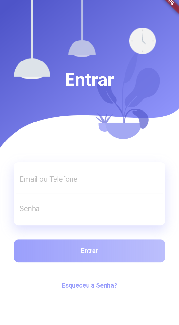

    

<h1 align="center">CashWise</h1>

    <a href="#about">About</a> • 
    <a href="#features">Features</a> • 
    <a href="#technologies">Technologies</a> • 
    <a href="#author">Author</a> 

### About

CashWise is a Flutter app designed to help users manage their personal expenses in an easy and efficient way. With an intuitive and user-friendly interface, the app allows users to record all their expenses and income quickly and in an organized manner.

### Features

- [x] Record expenses and income
- [x] Categorize expenses and income
- [x] View expenses and income in graphs
- [x] End-to-end encryption for security
- [x] Optional security PIN for app access

### Technologies

The following tools and technologies were used in the development of this project:

<table>
    <tr>
        <td><a href="https://flutter.dev/">Flutter</a></td>
    </tr>
    <tr>
        <td>2.2.0</td>
    </tr>
</table>

### Author

> Created by YOUR NAME HERE 👉 [YOUR LINKEDIN URL HERE](YOUR LINKEDIN URL HERE) • GitHub [@YOUR GITHUB USERNAME HERE](YOUR GITHUB URL HERE)
